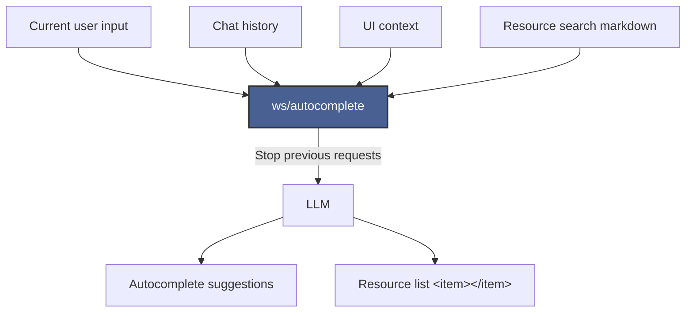
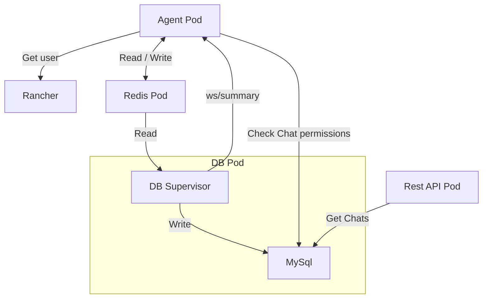

# Liz Autocomplete

Project link: https://hackweek.opensuse.org/25/projects/liz-prompt-autocomplete

## Description

Enhance the [Liz AI](https://github.com/rancher-sandbox/rancher-ai-ui) prompt interface by integrating an autocomplete feature that suggests relevant prompts and completions as users type, improving usability and efficiency.

### Features

- Real-time prompt suggestions based on user input and context / chat messages.
- Keyboard shortcuts to navigate and select suggestions.
- Propose resources items by typing wildcards followed by a resource name.
- Integration with Liz AI's existing prompt system.

### UI / UX

Liz can provide autocomplete suggestions, showing button hints to select the entire suggestion or navigate word by word.


Dropdown suggestion list appears as users type `@` + resource name.

**TODO**: add gif

### AI Agent

The Agent exposes a new `ws/autocomplete` endpoint to get autocomplete suggestions based on:
- Current user input
- Chat history
- UI context
- Resource search markdown

The endpoint will stop previous requests when a new one is made to ensure real-time responsiveness.



### Additional Agent Features

- The agent can now store data in a Redis database, to store Chats and Messages and handle User's permissions.
- The agent is now able to call Rancher API to get user information and associate user IDs with the Chats.
- The DB supervisor running in a separate pod is in charge of syncing the Redis cache with a MYSQL database.
- The agent exposes a new `ws/summary` endpoint to summarize the current conversation to assign a name to old conversations.
- The DB supervisor assign names to old conversations by calling the `ws/summary` endpoint.
- The Rest API server provides the chats history to the frontend.



### Installation

- Rancher, docker installation

  ```bash
  docker run -d --restart=unless-stopped -p 80:80 -p 443:443 -e CATTLE_BOOTSTRAP_PASSWORD=asd -e CATTLE_PASSWORD_MIN_LENGTH=3 --name rancher-head --privileged rancher/rancher:head
  ```

- AI assistant, install Helm chart
  
  ```bash
  git remote add torchiaf https://github.com/torchiaf/rancher-ai-agent.git
  git fetch torchiaf feature-autocomplete
  git checkout torchiaf/feature-autocomplete

  helm install ai-agent chart/agent \
  --namespace cattle-ai-agent-system \
  --create-namespace \
  --set "imagePullSecrets[0].name=gh-secret" \
  --set googleApiKey=your_token \
  --set ollamaUrl="" \
  --set llmModel=gemini-2.0-flash \
  --set insecureSkipTls=true \
  --set activeLlm=gemini \
  --set log.level=debug
  ```

- Rancher UI assistant extension

  ```bash
  git remote add volodymyr https://github.com/volodymyrkatkalov/rancher-ai-ui.git
  git fetch volodymyr arahja
  git checkout volodymyr/arahja

  # install yarn and node first
  yarn install
  API=https://your-local-ip yarn dev
  ```

### Resources

UI extension
  - Repo: https://github.com/volodymyrkatkalov/rancher-ai-ui
  - Branch: arahja

Agent
  - Repo: https://github.com/torchiaf/rancher-ai-agent
  - Branch: feature-autocomplete

DB: 
  - Repo: https://github.com/torchiaf/rancher-ai-db
  - Branch: main

Rest API
  - Repo: https://github.com/torchiaf/rancher-ai-chat-api
  - Branch: main

## Collaborators

- Francesco Torchia - [@torchiaf](https://github.com/torchiaf)
- Volodymyr Katkalov - [@volodymyrkatkalov](https://github.com/volodymyrkatkalov)
- Ovidiu Boc - [@oboc-sts](https://github.com/oboc-sts)